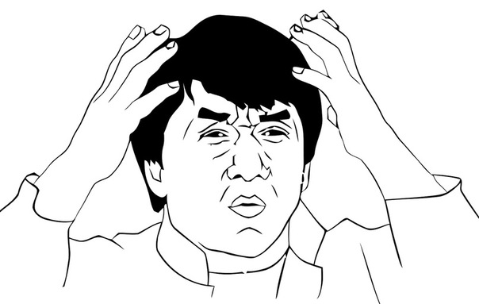

 

# Основы GraphQL  :heavy_exclamation_mark:
## Что это и зачем тебе GraphQL?  :information_desk_person:
GraphQL новый стандарт API (application programming interface — "программный интерфейс приложения"), который является более эффективной, мощной и гибкой альтернативой архитектуры REST (Representational State Transfer — "передача состояния представления").
GraphQL был разработан Facebook и является языком запросов для API.
API определяет каким образом клиент может получить данные с сервера.

Зачем был разработан GraphQL?

* Постоянный рост мобильного траффика :iphone: привел к необходимости эффективной загрузки данных.
> GraphQL минимизирует объем данных, которые нужно передать по сети и таким образом, улучшает использование приложений в условиях растущего мобильного траффика.

* Многообразие различных фронтэнд фреймворков и платформ
>  Огромное количество фронтэнд фреймворков и платформ которые управляют клиентскими приложениями делает достаточно трудоемким и сложным процессом создание и обслуживание одного API который будет удовлетворять всем требованиям. С GraphQL, каждый клиент может получить доступ к определенным данным, которые ему необходимы.

* Быстрая разработка и добавление новых возможностей
>  При использовании REST APIs, способ которым данные предоставляются сервером часто требуют модификации для соответствия специфическим требованиям и изменениям на стороне клиента.

## GraphQL лучше чем REST  :thumbsup:

### Сравнение получения данных с REST и GraphQL  :bar_chart:

При использовании REST API мы обычно собираем данные получая доступ к многочисленным конечным точкам.
Например, это может быть `/users/<id>` для доступа к данным пользователя. Потом нам понадобится обратиться к конечной точке `users/<id>/posts` , которая вернет все его посты. Ну и напоследок обратимся к `/users/<id>/followers` чтобы получить список подписчиков пользователя.


При использовании REST потребовалось три запроса для получения необходимой информации и, кстати, каждй раз мы получили немного лишних данных, которые мы не запрашивали.



С другой стороны, при использовании GraphQL, мы отправляем единственный запрос GraphQL серверу который включает в себя все требования для запрашиваемых данных. Сервер отправляет в ответ JSON объект где все требуемые поля уже заполнены.


### Итак больше никаких лишних данных и никакого недостатка при их получении :sweat_smile:. 

Одна из самых больших проблем REST архитектуры в том, что когда клиент загружает данные по ссылкам ему возвращаются фиксированные структуры данных, и довольно сложно разаработать API таким способом, чтобы клиенты получали только те данные, которые им необходимы.

В результате при загрузке JSON с данными пользователей загрузятся все данные, а не только их имена, например. Недополучение данных возникает потому что в возвращаемой информации недостаточно данных, например отсутствуют посты пользователя, поэтому нужно делать еще один запрос.

### Быстрая разработка Frontend  :rocket:

При использовании REST архитектуры любое изменение клиентской части, UI интерфейса чаще всего потребует изменение backend части.
С GraphQL можно производить изменения на стороне клиента без дополнительной работы на сервере.
Кроме того GraphQL позволяет анализировать статистику запросов на сервер и получение данных.

### Преимущества применения Схемы и Системы типов данных  :sparkles:

GraphQL использует строгую типизацию для определения возможностей API. Все типы, которые представлены API внесены в схему с использованием GraphQL SDL (Schema Definition Language). Эта схема составляет "контракт" между клиентом и сервером для определения того, каким образом клиент получит доступ к данным.

После того как схема определена, команды, работающие над бэкендом и фронтендом могут делать свою работу, не договариваясь об обмене данными, поскольку теперь будет определена структура данных для передачи по сети.

## Основы GraphQL

### Синтакис определения Схемы 

GraphQL имеет собственную систему типов для определения схемы взаимодействия с API. 

Пример синтаксиса Схемы - Schema Definition Language (SDL):

``` javascript
type Person {
  name: String!
  age: Int!
}
```

Итак здесь есть поля - `name` и `age` после чего указан соответствующий полям тип `String` и `Int`. `!` означает что поле является обязательным. Есть возможность использовать относительные типы:

``` javascript
type Post {
  title: String!
  author: Person!
}

type Person {
  name: String!
  age: Int!
  posts: [Post!]!
}
```
В примере пост `Post` привязан к автору `Person`. В свою очередь `Person` содержит поле `posts` которое привязано к массиву постов `[Post!]!`.

### Получаем данные с помощью запросов.

Пример запроса для получения данных с сервера:

``` javascript
{
  allPersons {
    name
   }
}
```
В этом случае ответом будет например:

``` javascript
{
  "allPersons": [
    { "name": "Johnny" },
    { "name": "Sarah" },
    { "name": "Alice" }
  ]
}
```
В GraphQL можно запрашивать аргументы для полей если они определены в Схеме. Например может быть определен аргумент для возврата определенного числа авторов:
``` javascript
{
  allPersons(last: 2) {
    name
  }
}
```
В данном случае будут возвращены два последних автора.

### Записываем данные с помощью мутаций.

Иногда необходимо вносить изменения в данные, сохраненные на бэкенде.
С GraphQL для выполнения таких изменений используем мутации. Есть три вида мутаций:

* Создание новых данных
* Обновление существующих данных
* Удаление существующих данных

Синтаксис мутаций похож на запросы кроме наличия ключевого слова `mutation` в самом начале.

``` javascript
mutation {
    createPerson(name: "Dimas", age: 36) {
    name
    age
    id
  }
}
```
И ответ сервера будет 

``` javascript
"createPerson": {
  "name": "Dimas",
  "age": 36,
  "id": "cjrj02ahv0yr00150f5xrvasp"
}
```
### Обновления в режиме реального времени с помощью подписок

Одно из важных требований для приложения - иметь постоянное соединение с сервером для своевременного получения информации о важных событиях. Для таких случаев GraphQL предлагает использовать подписки.

Когда клиент подписывается на событие, инициализируется и устанавливается устойчивое соединение с сервером. Как только произойдет это определенное событие, сервер отправит соответствующие данные на клиент. В отличие от запросов и мутаций которые используют типичный цикл "запрос-ответ", подписки представляют поток данных прислаемых клиенту.

Пример синтаксиса подписок:

``` javascript
subscription {
  newPerson {
    name
    age
  }
}
```
После того как клиент отправил эту подписку серверу между ними открыто соединение. Затем как только новая мутация будет выполнена и создаст пользователя `newPerson`, сервер отправит информацию об  этом пользователе на клиент.


``` javascript
{
  "newPerson": {
    "name": "Jane",
    "age": 23
  }
}
```

### Определяем Схему

Теперь, когда есть базовое понимание Запросов, Мутаций и Подписок, составим Схему которая будет работать для примеров, указанных выше.
В общем то Схема - это всего лишь коллекция типов GraphQL.

Итак начинаем с создания базовых типов:

``` javascript
type Query { ... }
type Mutation { ... }
type Subscription { ... }
```
Типы `Query`, `Mutation`, и `Subscription` будут являться входными точками для отправки запросов с клиента. Чтобы стал доступен запрос вида allPersons который был приведен в примере, тип `Query` должен содержать следующее:

``` javascript
type Query {
  allPersons: [Person!]!
}
```
Для остальных базовых типов добавляем то же самое, что использовалось в примерах, не забывая про аргументы.

``` javascript
type Query {
  allPersons(last: Int): [Person!]!
}

type Mutation {
  createPerson(name: String!, age: Int!): Person!
}

type Subscription {
  newPerson: Person!
}

type Person {
  name: String!
  age: Int!
  posts: [Post!]!
}

type Post {
  title: String!
  author: Person!
}
```
## Архитектура

GraphQL представлен как спецификация а это означает, что это всего лишь длинный документ, описывающий поведение GraphQL сервера.

3 основных случая использования GraphQL сервера:

1. GraphQL сервер соединенинный с базой данных

2. GraphQL сервер в качестве промежуточной прослойки для нескольких внешних сервисов или устаревших систем, которые интегрируются в единый GraphQL API

3. Смешанная концепция подключенной базы даных и сторонних сервисов или устаревших систем, к которым можно получить доступ через тот же GraphQL API 


